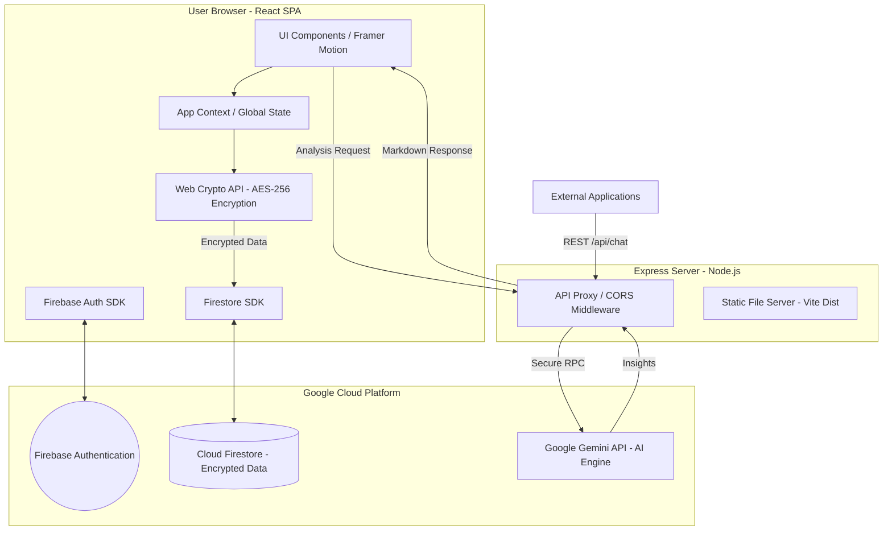

# Delight Finance - Technical Architecture

Delight Finance is a high-fidelity, secure financial intelligence dashboard built with a zero-knowledge encryption architecture and integrated AI analysis.

## Architecture Overview

## Core Components

### 1. Frontend (React 19 + TypeScript)
- **Vite & Tailwind CSS**: Modern build toolchain and utility-first styling.
- **Framer Motion**: Powering fluid UI transitions and the confirmation modal system.
- **Zero-Knowledge Encryption**: Financial data is encrypted on the client using `AES-256` before persistence. The server never sees raw financial values.

### 2. Backend (Express.js)
- **Unified Proxy**: Migrated Gemini calls from client to server to protect API keys and centralize analytical logic.
- **Externalized API**: Exposes `/api/chat` and `/api/health` with CORS headers, allowing external integration.
- **Vite Integration**: Operates as a development middleware in dev mode and a static file server in production.

### 3. Database & Auth (Firebase)
- **Firestore**: Real-time NoSQL storage for accounts, budgets, and audit logs.
- **Security Rules**: Robust server-side rules enforcing identity-based access and immutable audit trails.
- **Google OAuth**: Fast, secure authentication via Firebase Auth.

### 4. AI Engine (Gemini 3 Flash)
- **Financial Intelligence**: Context-aware analysis of spending trends and budget variances.
- **Audit Grounding**: Capable of querying historical audit logs to provide transparency on transaction modifications.

## Security & Compliance
- **AES-256 Encryption**: Every financial document is encrypted with a user-provided passphrase.
- **Immutable Audit History**: All "Create", "Update", and "Delete" actions are recorded in an audit trail that cannot be modified by users.
- **CORS Restricted**: API externalization is governed by secure middleware to prevent unauthorized cross-origin requests.

---
*Version: 2.0.0 | Release: Technical Architecture Finalization*
